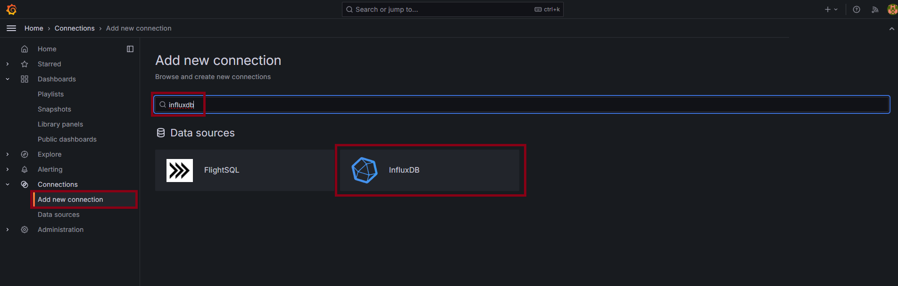
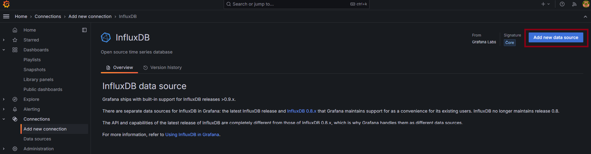
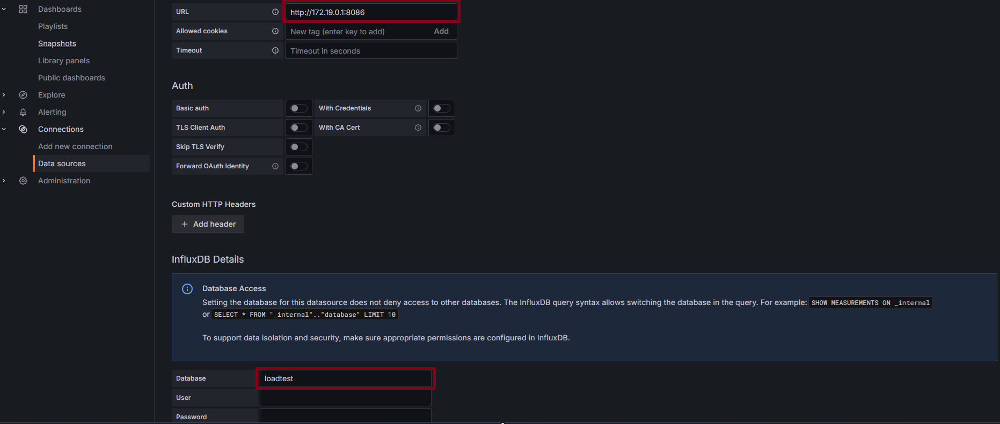
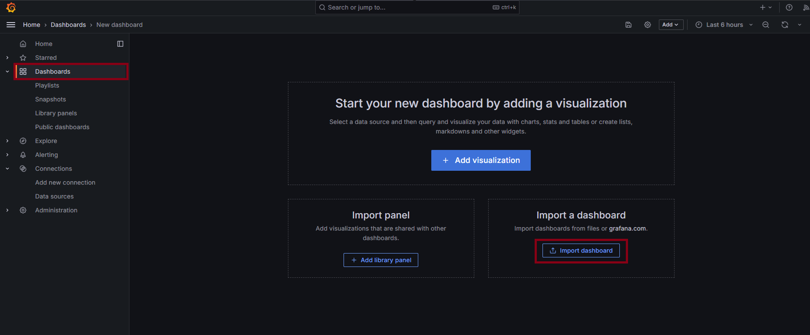
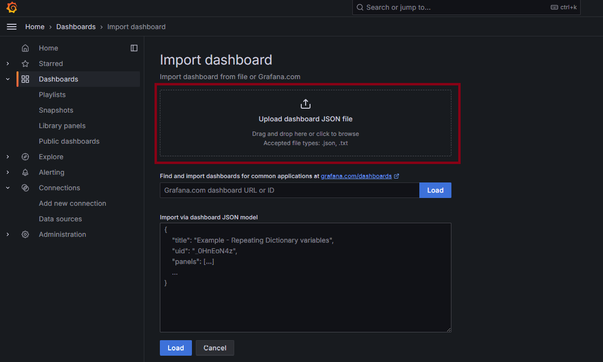
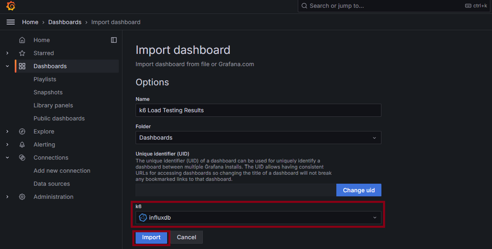

# K6 테스트와 Grafana 연동
<details>
<summary><b>K6 설치</b></summary>

- choco 설치
    ```bash
    Set-ExecutionPolicy Bypass -Scope Process -Force; [System.Net.ServicePointManager]::SecurityProtocol = [System.Net.ServicePointManager]::SecurityProtocol -bor 3072; iex ((New-Object System.Net.WebClient).DownloadString('https://community.chocolatey.org/install.ps1'))
    ```
- K6 설치
  ```bash
  choco install k6
  ```
  
- K6 js 작성
  ```java
  import http from 'k6/http';
  import { check, sleep } from 'k6';
  import {randomIntBetween, randomItem} from 'https://jslib.k6.io/k6-utils/1.2.0/index.js';
  
  // 테스트 설정
  export let options = {
    scenarios: {
        token_scenario: {
            executor: 'per-vu-iterations',
            vus: 10, // 가상 사용자 수
            iterations: 500, // 각 가상 사용자가 반복할 횟수, cpu 사용률 계속 100%를 유지하므로 최대 1만 건의 요청이 한계
            exec: 'token_scenario', // 실행할 함수
        },
    },
  };
  
  // 시나리오 함수
  export function token_scenario() {
  
    let userId = randomIntBetween(1, 152831);
  
    let payload = JSON.stringify({
                        customerId: userId
                    });
    let res = http.post('http://localhost:8080/api/tokens/generate', payload, {
                    headers: { 'Content-Type': 'application/json' },
                    tags: {name: 'token-generate'}
                }); // 요청할 엔드포인트
  
    check(res, {
          'is status 200': (r) => r.status === 200,
        });
  }
  ```
</details>

<details>
<summary><b>Grafana/InfluxDB 설치 (도커)</b></summary>

- docker-compose.yml 작성
  ```bash
  version: "3.8"
  
  services:
    influxdb:
      image: bitnami/influxdb:1.8.5
      container_name: influxdb
      ports:
        - "8086:8086"
        - "8085:8088"
      environment:
        - INFLUXDB_ADMIN_USER_PASSWORD=ssafy
        - INFLUXDB_ADMIN_USER_TOKEN=ssafy
        - INFLUXDB_HTTP_AUTH_ENABLED=false
        - INFLUXDB_DB=myk6db
    grafana:
      image: bitnami/grafana:latest
      ports:
        - "3000:3000"
  ```

- docker-compose 실행
  ```bash
  docker-compose up -d
  ```

- InfluxDB Database 생성
  ```bash
  docker exec -it influxdb influx
  create database "loadtest"
  ```
  
- Grafana DB Connection 생성
  ```text
  1. localhost:3000 접속
  2. 초기 ID : admin
  3. 초기 PW : admin
  ```
  
  
  
  
  
  ```text
  원래는 url에 http:/localhost:8086 만 적으면 되는데, 간혹 도커가 ip를 localhost로 연결 못 해주는 경우가 있다.
  그럴 때는 아래 방법으로 현재 influxdb의 ip주소를 찾으면 된다.
  ```
  ```bash
  curl -G http://localhost:8086/query --data-urlencode "q=SHOW DATABASES"
  
  docker logs influxdb
  ```
  그러면 아래처럼 로그에 주소가 찍혀있다.
  ```text
  [httpd] 172.19.0.2 - - [22/Aug/2024:22:03:52 +0000] "GET /query?db=loadtest&epoch=ms&q=SHOW+measurements HTTP/1.1" 200 57 "-" "Grafana/11.1.4" 6aa26e12-60d2-11ef-8003-0242ac130003 897
  ```

- 그라파냐 Dashboard 생성
  
  
  ```text
  ./req_dashboard.json 파일을 업로드한다.
  ```
  
</details>


<details>
<summary><b>K6 실행</b></summary>

- 일반 테스트
```bash
k6 run k6-test.js
```
- 그라파냐 연동 테스트
```bash
k6 run --out influxdb=http://localhost:8086/loadtest k6-test.js
```
- 결과 로그 .json 파일로 생성하는 테스트
```bash
k6 run --out json=results.json k6-test.js
```
</details>

[BackToReadMe](../../README.md)