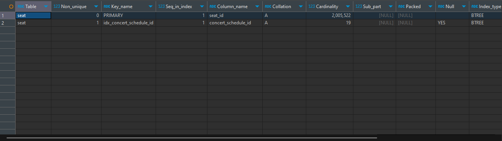
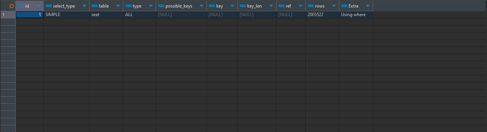
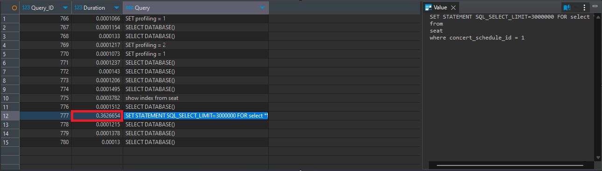
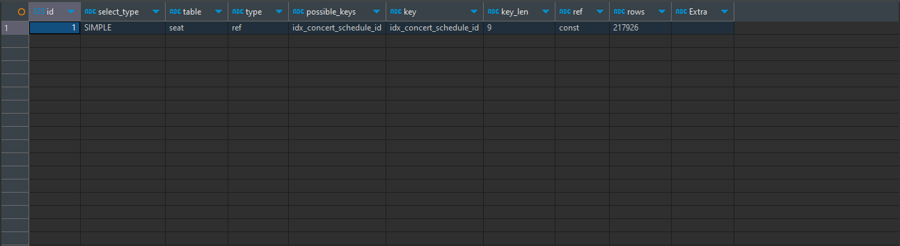
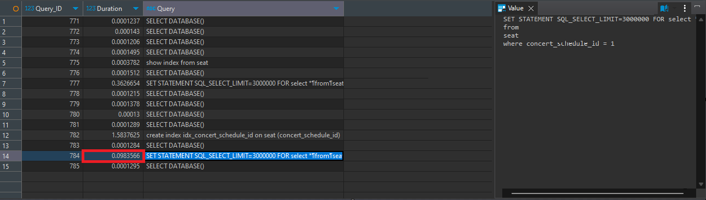

# Query 분석 및 인덱싱을 통한 조회 쿼리 개선
<details>
<summary><b>테스트 데이터 INSERT</b></summary>

- 멀티스레드를 이용한 빠른 적재

```java
    @Test
    @DisplayName("좌석 200만 건 저장")
    public void insertSeat() throws InterruptedException {
        int lastNum = 0;
        int finishedJ = 0;
        for(int i = 1; i <= 20; i++) {
            for(int j = 1; j <= 100000; j+=5) {
                Thread thread1 = new Thread(new MultiThread(j + lastNum, i, j, seatService));
                Thread thread2 = new Thread(new MultiThread(j + lastNum + 1, i, j, seatService));
                Thread thread3 = new Thread(new MultiThread(j + lastNum + 2, i, j, seatService));
                Thread thread4 = new Thread(new MultiThread(j + lastNum + 3, i, j, seatService));
                Thread thread5 = new Thread(new MultiThread(j + lastNum + 4, i, j, seatService));
                thread1.start();
                thread2.start();
                thread3.start();
                thread4.start();
                thread5.start();
                finishedJ = j + lastNum;
            }
            lastNum = lastNum + finishedJ;
        }
    }
```
</details>

<details>
<summary><b>분석</b></summary>

### 예약 가능한 콘서트 좌석 정보를 담고 있는 `Seat` 테이블에 인덱싱 적용

1. **예약 가능한 콘서트 좌석 조회**: 콘서트 스케줄 ID를 기반으로 예약 가능한 좌석을 조회

### Query 분석

1. **`findAvailableSeats` 쿼리**:
- **입력**: `concertScheduleId`
- **동작**: 콘서트 스케줄 ID에 해당하는 좌석을 조회
- **문제점**: 한 콘서트 당 좌석이 10만 개 정도 있다고 가정하면, 대량의 트래픽이 발생할 경우 최소 몇 백만 건의 데이터베이스 조회로 인한 성능 저하 발생 가능

### 인덱스 적용

예약 가능한 콘서트 일정 조회 시 대량의 트래픽이 발생할 경우 최소 몇 백만 건의 데이터베이스 조회로 인해 성능 저하가 발생할 수 있다고 판단, 이를 방지하기 위해 Seat 테이블에 concert_scheduled_id 컬럼을 인덱스로 생성하여 DB의 부하를 덜어 주기로 결정

### 인덱스 설명

1. **인덱스 생성**:
```sql
-- SQL문으로 인덱스를 만들 경우
CREATE INDEX idx_concert_schedule_id ON SEAT (concert_schedule_id);
```
```java
// SprintBoot JPA로 생성할 경우
@Table(name = "seat", indexes = { @Index(name = "idx_concert_schedule_id_and_finally_reserved", columnList = "concert_schedule_id") })
```

2. **인덱스 조회**:
```sql
-- SQL문으로 인덱스 조회
SHOW INDEX FROM SEAT;
```


### 적용 후 기대 효과

- **검색 성능 향상**: 전체 테이블을 스캔하는 대신 인덱스(idx_concert_schedule_id)를 참조하여 원하는 데이터를 검색.

</details>

<details>
<summary><b>인덱스 적용 테스트 결과</b></summary>

### `DBeaver를 통한 결과 확인`

- 쿼리의 실행시간을 볼 수 있도록 Profile 생성
```sql
SET profiling = 1;
```
- 인덱스 없이 Seat 테이블 조회
```sql
SELECT *
FROM SEAT
WHERE concert_schedule_id = 1;
```
- 인덱스 생성 전 쿼리 EXPLAIN 확인
```sql
EXPLAIN
SELECT *
FROM SEAT
WHERE concert_schedule_id = 1;
```

- 인덱스 생성 전 쿼리 실행시간 확인
```sql
SHOW PROFILES
```

- 인덱스 생성
```sql
CREATE INDEX idx_concert_schedule_id ON SEAT (concert_schedule_id);
```
- 인덱스 확인
```sql
SHOW INDEX FROM SEAT;
```

- 인덱스 생성 후 쿼리 EXPLAIN 확인
```sql
EXPLAIN
SELECT *
FROM SEAT
WHERE concert_schedule_id = 1;
```

- 인덱스 생성 후 쿼리 실행시간 확인
```sql
SHOW PROFILES
```

### `테스트 결과`
- Explain에서 Type이 ref인 것을 확인하여 Index를 통한 조회가 잘 되었음을 알 수 있다.
- 쿼리 조회 시간이 0.36초 -> 0.09초로 향상되었다.
- 총 데이터 200만 건에서 10만 건을 조회한 경우라 0초대가 나오긴 했지만, 그래도 대량의 트래픽이 발생할 경우에는 1초가 걸리는 쿼리도 리스크가 있으므로 유의미한 쿼리 개선 효과라고 생각한다.
</details>

[BackToReadMe](../../README.md)